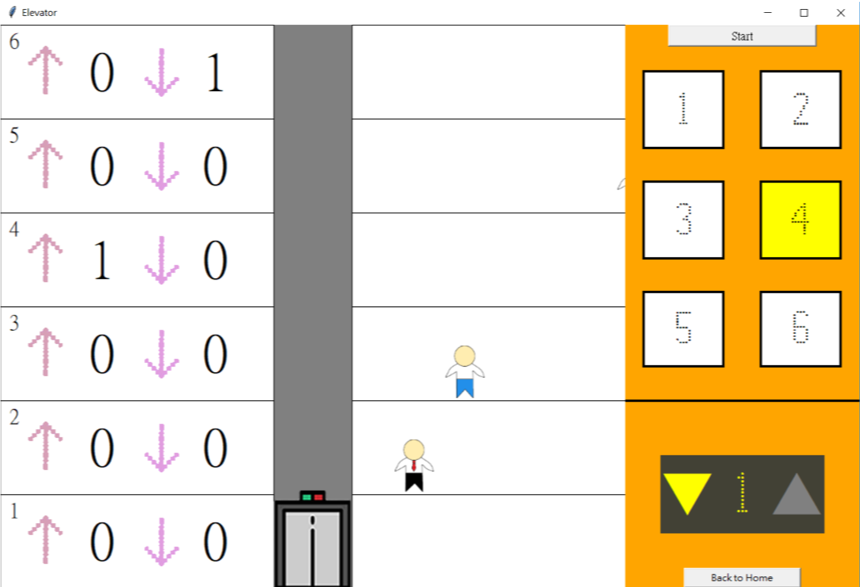
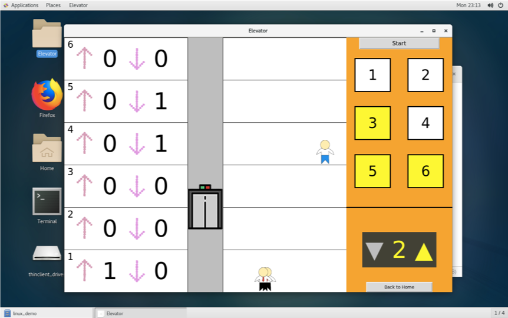

# Elevator
### 程式需求
- Python 3.7
- Tkinter
- Pillow 5.3.0
- Pygame 1.9.4

### Pyinstaller-3.3.1 打包
- Linux Version
- Window Version
- `pyinstaller elevator_gui.py -F --hidden-import="PIL._tkinter_finder" -i 'icon 路徑'`

### Window Version

### Linux Version

